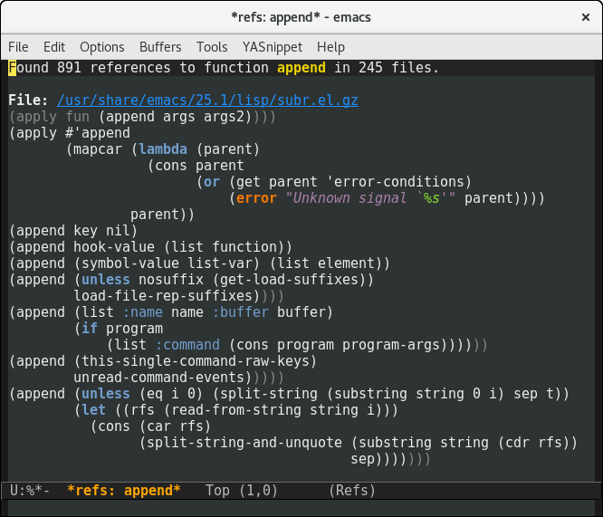

# refs.el
[](https://travis-ci.org/Wilfred/refs.el)
[](https://coveralls.io/github/Wilfred/refs.el?branch=master)

refs.el is an Emacs package for finding references to functions,
macros or variables. Unlike a dumb text search, refs.el actually
parses elisp, so it's never confused by comments or `foo-bar` matching
`foo`.



This is particularly useful for finding all the places a function is
used, or finding examples of usage.

## Commands available

* `refs-function` (find function calls)
* `refs-macro` (find macro calls)
* `refs-variable` (find variable references)
* `refs-special` (find special form calls)
* `refs-symbol` (find all references to a symbol)

## Semantic analysis

refs.el has *street smarts*: given `(defun foo (bar) (baz))`, it
understands that `bar` is a variable and `baz` is a function.

refs.el understands the following forms:

* `defun` `defsubst` `defmacro` `cl-defun`
* `lambda`
* `let` `let*`
* `funcall` `apply`
* sharp quoted expressions

## Limitations

refs.el understands elisp special forms, and a few common
macros. However, it cannot understand arbitrary macros.

Therefore refs.el will assume that `(other-macro (foo bar))` is a
function call to `foo`. If this is incorrect, you may wish to use the
command `refs-symbol` to find all references to the `foo` symbol.

If `other-macro` is a common macro, please consider submitting a patch
to `refs--function-p` to make refs.el smarter.

## Running tests

You can run the tests with:

```
$ cask install
$ cask exec ert-runner
```

## Performance

refs.el is CPU-intensive elisp and has been carefully optimised. You
can run the benchmark script with:

```
$ cask install
$ ./bench.sh
```

New features are carefully measured to ensure performance does not get
worse.

See refs-bench.el for more details.

## Changelog

v1.0: Initial release.

## Alternative Projects

**TAGS**: It is possible to record function references in TAGS
files. Whilst [universal-ctags](https://github.com/universal-ctags/ctags) (formerly
known as exuberant-ctags) does provide the ability to find references,
it is not supported in its lisp parser.

etags, the TAGS implementation shipped with Emacs, cannot find
references (to my knowledge).

**el-search**:
[el-search](https://elpa.gnu.org/packages/el-search.html) allows you
to search for arbitrary forms in elisp files. It's slower, but a much
more general tool. Its design greatly influenced refs.el.
